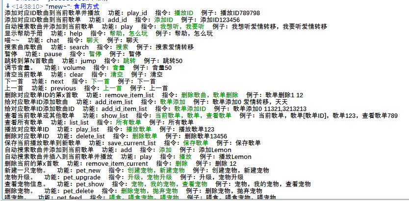
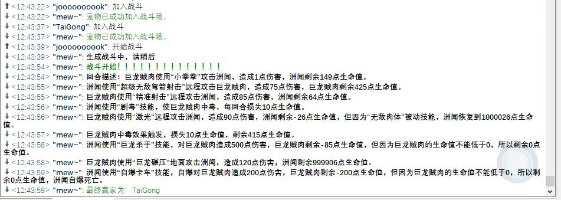
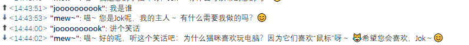
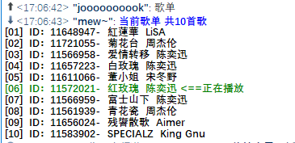

# ts3MusicBot
- [English](README_en.md)
- [Zh](README.md)
## 👋Introduction
A simple python bot based on TS3AudioBot for teamspeak3.

基于TS3AudioBot的简易teamspeak3机器人框架。

## 🚩Features
- 🎵Basic Music Features
  - Play music.
  - Playlist management.
  - ....
- 🤖Chat Function: Chat with AI.
- 🐶Pet Feature: Create your own pet and engage in battles.
- 📢Broadcast Function: TTS announcements.
- Custom Commands
- Custom API
- ....

 

## ⚙️Installation
Make sure you have installed the [TS3AudioBot](https://github.com/Splamy/TS3AudioBot)   .
~~~bash
git clone https://github.com/Joooook/ts3MusicBot
pip install -r requirements.txt
~~~

## ▶️Quick Start
Please check the [Guide](docs/Guide.md) first.
~~~python
from apis.chatApi.ChatApi import ChatApi
from apis.petApi.PetApi import PetApi
from apis.ttsApi.TTSApi import TTSApi
from TS3Bot import TS3Bot,my_commands
from examples.ExampleMusicApi import ExampleMusicApi
if __name__ == '__main__':
    bot_api = "http://x.x.x.x:58913"
    chat_api_key = "sk-xxxxxxxxxxx"
    tts_api = "www.?.?"
    password= 'password'
    server_host = 'xxx.xxx.xxx.xxx'
    bot = TS3Bot('serveradmin', password, bot_api, server_host)
    # 创建并注册api
    example_music_api = ExampleMusicApi("https://www.xxxxxxx.xxxxx/")
    bot.register_music_api(example_music_api,"default",priority=50)
    bot.chat_api = ChatApi(chat_api_key)
    bot.pet_api = PetApi(chat_api_key)
    bot.tts_api = TTSApi(tts_api)
    # 注册指令
    bot.register_commands(my_commands)
    bot.run()
~~~
## ⚠️Notice
Although it comes with many basic features, this is not a ready-to-use project but more like a framework that requires further development, especially regarding the music API part.

## 👉️Reference

- [ZHANGTIANYAO1/TS3AudioBot-NetEaseCloudmusic-plugin](https://github.com/ZHANGTIANYAO1/TS3AudioBot-NetEaseCloudmusic-plugin)
- [Splamy/TS3AudioBot](https://github.com/Splamy/TS3AudioBot)
- [benediktschmitt/py-ts3](https://github.com/benediktschmitt/py-ts3)
- [Binaryify/NeteaseCloudMusicApi](https://github.com/Binaryify/NeteaseCloudMusicApi)

## 💭Murmurs
Initially, I used the project: [ZHANGTIANYAO1/TS3AudioBot-NetEaseCloudmusic-plugin](https://github.com/ZHANGTIANYAO1/TS3AudioBot-NetEaseCloudmusic-plugin). The fundamental reason for creating this bot was that the Netease API became unavailable due to certain unforeseen circumstances, which resulted in many songs being inaccessible. Fortunately, I decided to create my own solution. However, since there is no Python SDK available for TeamSpeak, I had to use the [pyts3](https://github.com/benediktschmitt/py-ts3) project to control the ServerQuery in conjunction with [Ts3AudioBot](https://github.com/Splamy/TS3AudioBot).

This is just a humble attempt. As I am currently a student, updates to the wiki may be slower. I welcome any encouragement to update it more frequently.

## ☕️Donate

 

